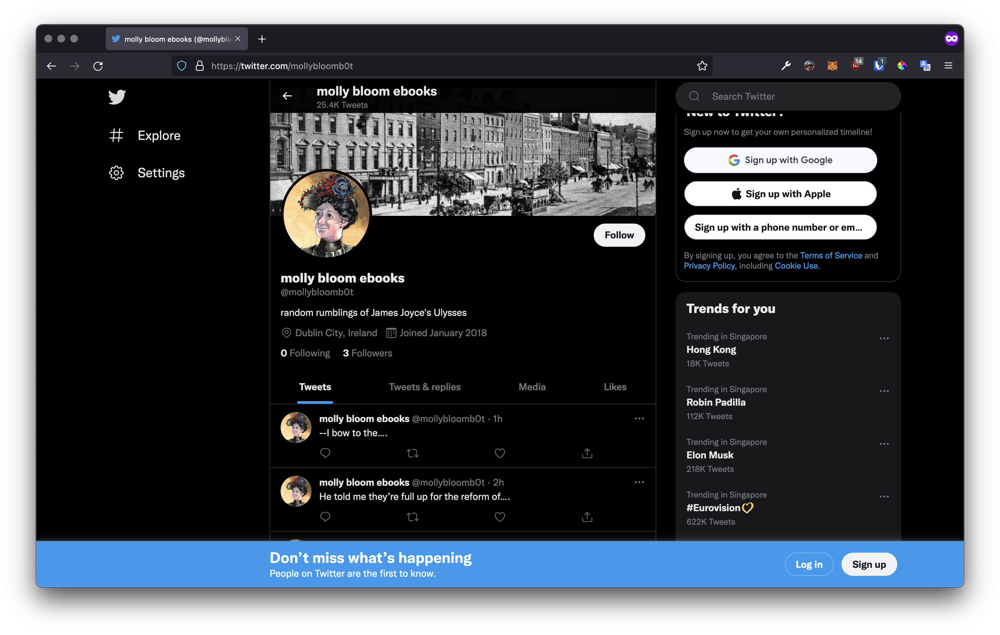
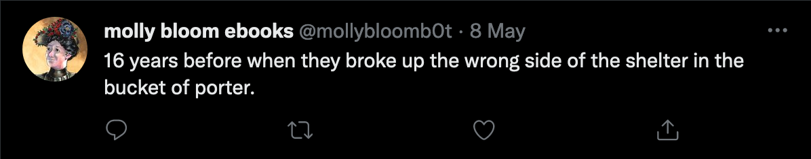

# `📖` The Post
> **[Core Interaction Studio](https://github.com/majiinbju/core-interaction-studio-2018)** 
> *Parsons School of Design 
> Communication Design 
> Spring 2018 &nbsp;&middot;&nbsp;
> Tuesday &nbsp;&middot;&nbsp; 9:00 - 11:40 am //
> Thursday &nbsp;&middot;&nbsp; 9:00 - 11:40 am*
---
## 🎯 Objective
> As graphic designers, it is important to understand the internet and its platforms as a medium. What do certain platforms allow for that others do not? How might a platform transform a user's perception of content? Does the design of some platforms feel invisible? What are the implications of posting content on one platform as opposed to another?

> For our first project, find a piece of content that has surpassed its copyright (`archive.org`, `ubu.web` are good places to start your search). Think about the content's form and message. What qualities stick out to you (is it divided into stanzas? is it repetitive? does it have a linear narrative? was it meant to be rearranged? can it be rearranged? does it have no letter e?)? Publish your selected text on a platform of your choice. Think about how this act of publishing emphasizes a quality of your content (it does not have to be all at once). How has the content changed through your platform? What is something new that this publishing act has revealed about your content?

> How will the reading of the text be affected by the choice of platform? Does the TUMBLR community create a different context for writing and images than the Second Life community for example? Think also about the technical constraints of different platforms. How are texts broken up? In 140 character blurbs? In longer sequences? How does each piece of text link to the next one. Are there different voices you can use? Can the text be broken up into sequential sections? What about parallel sections? How does the text look on the page? How do all these elements affect your reading of the text? How many of these elements can you control? What is the typical way we read text on the service you are using? Are you interrupting this ‘usual’ read, using it to your advantage?

> Document your project through screenshots and think carefully about its presentation. 
---
## 💡 Idea
> The novel Ulysses by James Joyce features one of the longest sentences ever recorded in a book. Rather than being coherent and long, the sentence is more like a group of small sentences put together. Hence, the idea of a twitter bot to suits this group. Final presentation for the project can be found [here](thepost_presentation_final.pdf). 
---
## 🧪 Results

---
> [bajju.info](https://www.bajju.info) &nbsp;&middot;&nbsp;
> [@majiinbju](https://github.com/majiinbju) &nbsp;&middot;&nbsp;
> [linkedin](https://www.linkedin.com/in/vivek-bajaj-4a8035152/) &nbsp;&middot;&nbsp;
> [email](mailto:hi@vivekbajaj.design)
---
